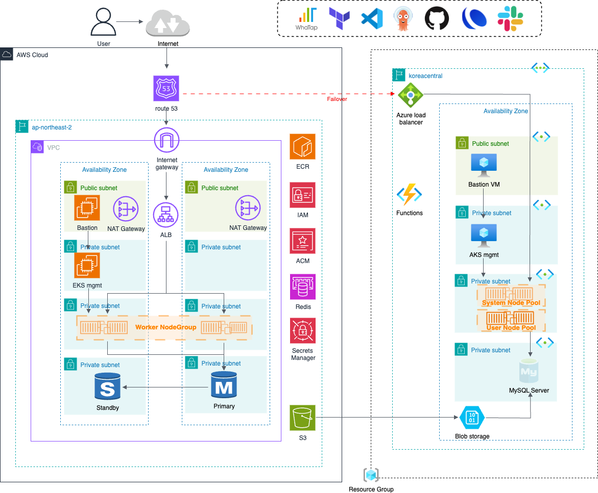

# 🌐 Petclinic Reverse Proxy (Web Tier)

This repository contains the **Web Tier** component in a 3-Tier Petclinic architecture.  
It configures an HTTP reverse proxy (Apache HTTPD) that routes incoming traffic to the Application Tier (Spring Boot app).

---

## 🏗️ Architecture


---

## 🛠️ Tech Stack

- Apache HTTPD  
- `httpd.conf` configured with reverse proxy settings  
- Docker  

---

## ▶️ How to Run Locally

```bash
docker build -t petclinic-web .
```

---

## 🔧 Proxy Behavior

The reverse proxy forwards all incoming HTTP traffic to the backend:

```
http://localhost:80 → http://<APP_SERVICE_HOST>:8080/petclinic
```

- Actual application responses are served from the App Tier  
- This layer handles only HTTP-level proxying (no UI logic)

---

## 📂 Notes

- To use in production, configure proper service name (e.g. via Kubernetes service DNS)
- Deployment configuration is managed in the [`manifest`](https://github.com/sophie-in-the-cloud/petclinic-manifest) repository
